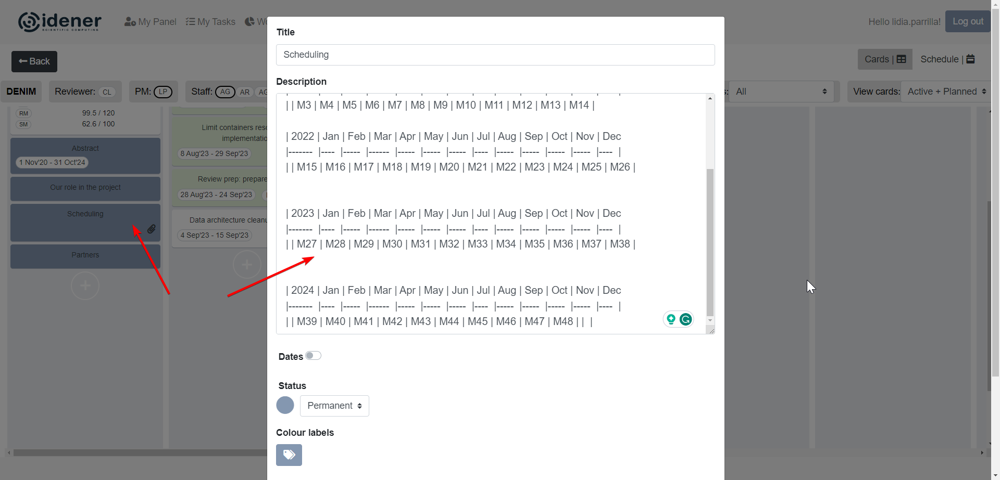
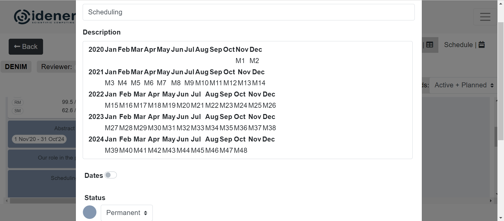

# Month Table Generator

This script generates a Markdown table for months starting from a given month and year, for a specified number of months.

The script is expected to be used for creating the table that can be pasted into the IT boards (Project column, scheduling card)



And this is how it will look like afterwards. 



Pretty useful for a quick consultation of what each project month corresponds to in the calendar!

## Usage

Run the script using Python and provide the required arguments:

```bash
python main.py -m [start_month] -y [start_year] -n [num_months]
```

Use python main.py -h for instructions.
